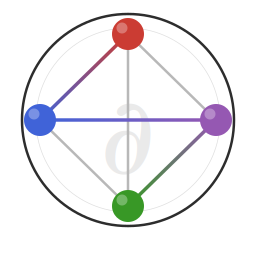

<p align="center">
  
</p>

# PowerModelsDiff.jl

[](https://github.com/grid-opt-alg-lab/PowerModelsDiff.jl/actions/workflows/CI.yml)
[](https://grid-opt-alg-lab.github.io/PowerModelsDiff.jl/dev/)

A Julia package for differentiable power system analysis. Compute sensitivities of power flow solutions, optimal power flow dispatch, and locational marginal prices with respect to network parameters.

## Features

- **Unified sensitivity API**: `calc_sensitivity(state, :operand, :parameter)` with `Sensitivity{T}` return type
- **DC OPF**: B-theta formulation with analytical KKT sensitivities for demand, switching, cost, flow limits, and susceptances
- **DC power flow**: Switching and demand sensitivities via matrix perturbation theory
- **AC power flow**: Voltage and current sensitivities w.r.t. power injections
- **AC OPF**: Switching sensitivities via implicit differentiation with ForwardDiff
- **LMP analysis**: Locational marginal prices with energy/congestion decomposition
- **Load shedding**: Sensitivity of optimal load curtailment to network parameters

## Installation

```julia
using Pkg
Pkg.add(url="https://github.com/grid-opt-alg-lab/PowerModelsDiff.jl.git")
```

## Quick Start

```julia
using PowerModelsDiff, PowerModels

net = make_basic_network(parse_file("case14.m"))
dc_net = DCNetwork(net)
d = calc_demand_vector(net)

# Solve DC OPF and compute sensitivities
prob = DCOPFProblem(dc_net, d)
solve!(prob)

dlmp_dd = calc_sensitivity(prob, :lmp, :d)   # dLMP/dd (n x n)
dpg_dsw = calc_sensitivity(prob, :pg, :sw)   # dg/dsw (k x m)

dlmp_dd.formulation  # :dcopf
dlmp_dd[2, 3]        # dLMP_2 / dd_3
```

See the [Getting Started guide](https://grid-opt-alg-lab.github.io/PowerModelsDiff.jl/dev/getting-started/) for DC/AC power flow and OPF walkthroughs.

## Documentation

- [Getting Started](https://grid-opt-alg-lab.github.io/PowerModelsDiff.jl/dev/getting-started/) — DC PF, DC OPF, AC PF, AC OPF walkthroughs
- [Sensitivity API](https://grid-opt-alg-lab.github.io/PowerModelsDiff.jl/dev/sensitivity-api/) — Operand/parameter tables, valid combinations, indexing
- [Mathematical Background](https://grid-opt-alg-lab.github.io/PowerModelsDiff.jl/dev/math/) — B-theta formulation, KKT implicit differentiation
- [Advanced Topics](https://grid-opt-alg-lab.github.io/PowerModelsDiff.jl/dev/advanced/) — Type hierarchy, caching, solver configuration
- [API Reference](https://grid-opt-alg-lab.github.io/PowerModelsDiff.jl/dev/api/) — Full docstring reference

## Dependencies

- [PowerModels.jl](https://github.com/lanl-ansi/PowerModels.jl) — Power system modeling
- [JuMP.jl](https://github.com/jump-dev/JuMP.jl) — Optimization modeling
- [Clarabel.jl](https://github.com/oxfordcontrol/Clarabel.jl) — Default DC OPF solver
- [Ipopt.jl](https://github.com/jump-dev/Ipopt.jl) — AC OPF solver
- [ForwardDiff.jl](https://github.com/JuliaDiff/ForwardDiff.jl) — Automatic differentiation

## License

Apache License 2.0
