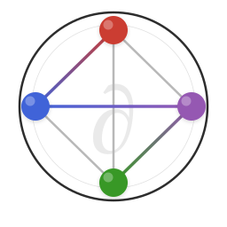

<p align="center">
  
</p>

# PowerDiff.jl

[](https://github.com/grid-opt-alg-lab/PowerDiff.jl/actions/workflows/CI.yml)
[](https://samueltalkington.com/research/powerdiff/)

A Julia package for differentiable power system analysis. Compute sensitivities of power flow solutions, optimal power flow dispatch, and locational marginal prices with respect to network parameters.

## Features

- **Unified sensitivity API**: `calc_sensitivity(state, :operand, :parameter)` with `Sensitivity{T}` return type
- **DC OPF**: B-theta formulation with analytical KKT sensitivities for demand, switching, cost, flow limits, and susceptances
- **DC power flow**: Switching and demand sensitivities via matrix perturbation theory
- **AC power flow**: Voltage and current sensitivities w.r.t. power injections
- **AC OPF**: Full sensitivity analysis (switching, demand, costs, flow limits) via implicit differentiation of KKT conditions
- **LMP analysis**: Locational marginal prices with energy/congestion decomposition
- **Load shedding**: Sensitivity of optimal load curtailment to network parameters

## Installation

> Requires Julia 1.10 or later.

```julia
using Pkg
Pkg.add("PowerDiff")
```

## Quick Start

```julia
using PowerDiff

# Parse a case into a PowerIO module
net = parse_file("case14.m")
dc_net = DCNetwork(net)
d = calc_demand_vector(net)

# Solve DC OPF and compute sensitivities
prob = DCOPFProblem(dc_net, d)
solve!(prob)

dlmp_dd = calc_sensitivity(prob, :lmp, :d)   # dLMP/dd (n x n)
dpg_dsw = calc_sensitivity(prob, :pg, :sw)   # dg/dsw (k x m)

dlmp_dd.formulation  # :dcopf
dlmp_dd[2, 3]        # dLMP_2 / dd_3
```

See the [Getting Started guide](https://samueltalkington.com/research/powerdiff/getting-started/) for DC/AC power flow and OPF walkthroughs.

## Documentation

- [Getting Started](https://samueltalkington.com/research/powerdiff/getting-started/) — DC PF, DC OPF, AC PF, AC OPF walkthroughs
- [Sensitivity API](https://samueltalkington.com/research/powerdiff/sensitivity-api/) — Operand/parameter tables, valid combinations, indexing
- [Mathematical Background](https://samueltalkington.com/research/powerdiff/math/dc-power-flow/) — B-theta formulation, KKT implicit differentiation
- [Advanced Topics](https://samueltalkington.com/research/powerdiff/advanced/) — Type hierarchy, caching, solver configuration
- [API Reference](https://samueltalkington.com/research/powerdiff/api/) — Full docstring reference

## Input Format

PowerDiff reads files through PowerIO, and `parse_file` reads every transmission
format the linked PowerIO library does — MATPOWER `.m`, PSS/E `.raw`, PowerWorld,
PowerModels JSON, Egret JSON, pandapower, PyPSA, PSLF, gridfm, GO Challenge 3 and
the rest. The format tokens are PowerIO's, so a reader PowerIO gains works here at
once.

A path's format is inferred from its extension; a stream has no extension, so pass
`from` (MATPOWER is assumed otherwise). A bare `json` names a container rather than
a reader, so name the one you mean: `from=:powermodels`, `:egret`, `:pandapower`.

`parse_file` returns a `PowerIO.PioModule`. Beyond the case itself it carries
`m.diagnostics`, the reader's findings as records you can branch on by `code` and
`severity`; `m.sources[1].format`, the reader that ran; and enough for
`PowerIO.emit(m, "psse", path)` to write the case out again.

## Contributing

See [CONTRIBUTING.md](CONTRIBUTING.md) for how to run the tests and build the docs.
Maintainers cutting a release follow [RELEASING.md](RELEASING.md).

## Dependencies

- [PowerIO.jl](https://github.com/eigenergy/PowerIO.jl) — Parser and data layer (see [PowerIO Integration](https://samueltalkington.com/research/powerdiff/powerio-integration/))
- [JuMP.jl](https://github.com/jump-dev/JuMP.jl) — Optimization modeling
- [ExaModels.jl](https://github.com/exanauts/ExaModels.jl) — Alternative optimization modeling for GPU parallelization
- [Ipopt.jl](https://github.com/jump-dev/Ipopt.jl) — Default solver for DC and AC OPF

## License

Apache License 2.0
